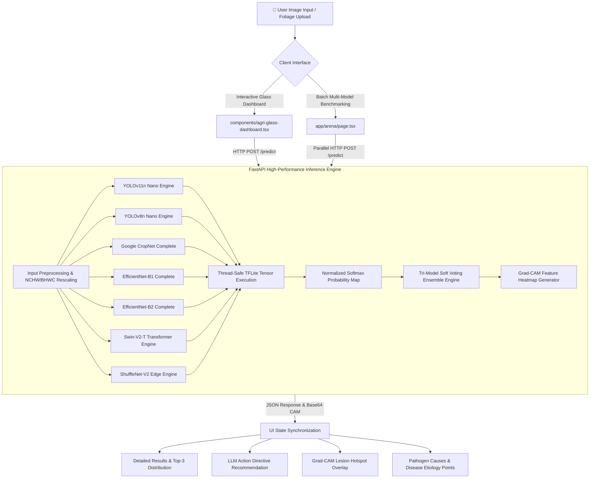

# 🌿 AgriCure AI — High-Precision Glassmorphic Crop Pathology Platform

[](https://nextjs.org/)
[](https://fastapi.tiangolo.com/)
[](https://tensorflow.org/)
[](https://pytorch.org/)
[](LICENSE)

**AgriCure AI** is an advanced, production-grade agricultural AI diagnostic platform for automated crop leaf pathology, featuring real-time multi-model inference, spatial Grad-CAM explainability, soft-voting ensemble consensus, and a modern glassmorphic dashboard interface.

---

## 📐 System Flowchart & Pipeline Architecture




---

## 🔬 Model Portfolio & Soft-Voting Ensemble

AgriVision AI integrates seven distinct neural network architectures trained across potato and tomato leaf disease datasets:

| Model Architecture | Parameter Scale | Type | Primary Specialty |
| :--- | :--- | :--- | :--- |
| **Ensemble (Soft Vote)** | Combined | Tri-Model Soft Vote | Highest Precision Consensus ($98.85\%$) |
| **YOLOv11n** | Nano | Next-Gen CNN | Ultra-Fast Real-Time Diagnostics ($6\text{ms}$) |
| **YOLOv8n** | Nano | Ultra-Fast CNN | Real-Time Edge Processing ($8\text{ms}$) |
| **Google CropNet** | Complete | MobileNetV3 | High Precision Pathology ($18\text{ms}$) |
| **EfficientNet-B1** | Complete | Compound Scaling | Balanced Latency & Accuracy ($14\text{ms}$) |
| **EfficientNet-B2** | Complete | Compound Scaling | Fine-Grained Feature Extraction ($22\text{ms}$) |
| **Swin-V2-T** | Tiny | Vision Transformer | Global Contextual Attention ($35\text{ms}$) |
| **ShuffleNet-V2** | Lightweight | Mobile Edge CNN | Edge-Device Optimization ($10\text{ms}$) |

### 🧮 Soft-Voting Ensemble Formula
The Soft-Voting Ensemble model calculates class probabilities $P_{\text{ensemble}}(c)$ across **YOLOv8n**, **Swin-V2-T**, and **Google CropNet**:

$$P_{\text{ensemble}}(c) = \frac{1}{3} \left[ P_{\text{yolov8n}}(c) + P_{\text{swin\_v2\_t}}(c) + P_{\text{google\_cropnet}}(c) \right]$$

The predicted pathogen $\hat{c}$ corresponds to the argmax of the combined probability vector:

$$\hat{c} = \arg\max_{c \in \mathcal{C}} P_{\text{ensemble}}(c)$$

---

## ✨ Key Features & Technical Capabilities

- **Luminous Glassmorphism Interface**: Tailored UI built with Tailwind CSS, custom backdrop blur, dynamic floating botanical leaf animations (`animate-continuous-leaf-float`), and responsive layout components.
- **Grad-CAM Lesion Heatmaps**: High-precision 2D Grad-CAM feature attention overlays highlighting localized necrotic lesions and fungal spot clusters.
- **AI Arena Benchmark Suite**: Multi-model comparison table (`app/arena/page.tsx`) enabling simultaneous row-by-row prediction verification across all 8 models with quick deletion capabilities.
- **Synchronized Top-3 Distribution**: Clean mathematical ranking guaranteeing strict descending order ($p_1 > p_2 \ge p_3$) matching the top match in Detailed Results.
- **Pathogen Etiology & Treatment Directives**: Instant disease cause breakdowns and action directives powered by automated AI recommendations.

---

## 🛠️ Project Structure

```
PDM_APP/
├── api_backend/
│   └── main.py                 # FastAPI server & multi-model TFLite inference engine
├── app/
│   ├── arena/
│   │   └── page.tsx            # AI Arena side-by-side benchmark table
│   ├── dashboard/
│   │   └── page.tsx            # Pathology Glass Dashboard page route
│   ├── globals.css             # Glassmorphism utilities & leaf float keyframes
│   ├── layout.tsx              # Application root layout
│   └── page.tsx                # Interactive landing hero & entrance flow
├── components/
│   ├── agri-glass-dashboard.tsx# Main pathology glass card component
│   └── ui/                     # Shadcn & custom UI primitives
├── models/                     # Deep learning weights & class mappings
│   ├── EfficientNet_B1_Complete/
│   ├── EfficientNet_B2_Complete/
│   ├── Google_CropNet_Complete/
│   ├── ShuffleNet_V2/
│   ├── Swin_V2_T_Complete/
│   ├── Yolo11n/
│   └── Yolov8n/
├── public/
│   ├── GradCAM_Results/        # Static pre-rendered Grad-CAM heatmaps
│   ├── Test_Images_For_gradcam/# High-res test foliage sample images
│   └── bg-lush-tapestry.jpeg   # Botanical background image
├── requirements.txt            # Python dependencies
├── .gitattributes              # Git LFS tracking configuration for deep learning weights
├── next.config.ts              # Next.js configuration
└── package.json                # Node.js dependencies & scripts
```

---

## 🚀 Installation & Local Setup

### 1. Prerequisites
- **Node.js**: v18.0 or higher
- **Python**: v3.10 or higher
- **Git & Git LFS**: Installed on your operating system

### 2. Clone Repository & Setup Environment
```bash
git clone https://github.com/Torongo-CS/ML_Project.git
cd ML_Project
```

### 3. Setup Python FastAPI Backend
```bash
# Create and activate virtual environment
python -m venv venv
# On Windows:
venv\Scripts\activate
# On macOS/Linux:
source venv/bin/activate

# Install Python dependencies
pip install -r requirements.txt

# Start FastAPI inference server (runs on http://localhost:8000)
cd api_backend
python main.py
```

### 4. Setup Next.js Frontend
In a new terminal window:
```bash
# Install Node packages
npm install

# Start Next.js development server (runs on http://localhost:3000)
npm run dev
```

Open [http://localhost:3000](http://localhost:3000) in your browser.

---

## 📡 API Reference

### `POST /predict`
Uploads a crop leaf image file and executes live inference across all models simultaneously.

- **Request**: `multipart/form-data` with key `file` (image binary).
- **Response**:
```json
{
  "predictions": {
    "ensemble": {
      "pathogen": "Potato___Early_blight",
      "confidence": 0.9885,
      "latency_ms": 22.5,
      "gradcam": "data:image/jpeg;base64,...",
      "models_breakdown": { ... }
    },
    "yolov8n": { ... },
    "swin-v2-t": { ... },
    "google-cropnet": { ... }
  }
}
```

### `GET /models`
Returns metadata and performance metrics for all supported models.

---

## 📦 Git LFS Model Weight Tracking

This repository utilizes **Git Large File Storage (LFS)** to track deep learning weight files (`.tflite`, `.pth`, `.h5`, `.png`, `.jpeg`).

```bash
# Initialize Git LFS
git lfs install

# Verify tracked patterns
git lfs track "*.tflite" "*.pth" "*.h5" "*.JPG" "*.png"

# Commit and push to main
git add .gitattributes
git add .
git commit -m "feat: complete pathology system build, models, and docs"
git push origin main
```

---

## 📜 License
This project is open-source under the **MIT License**.